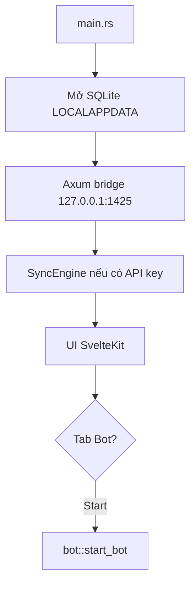
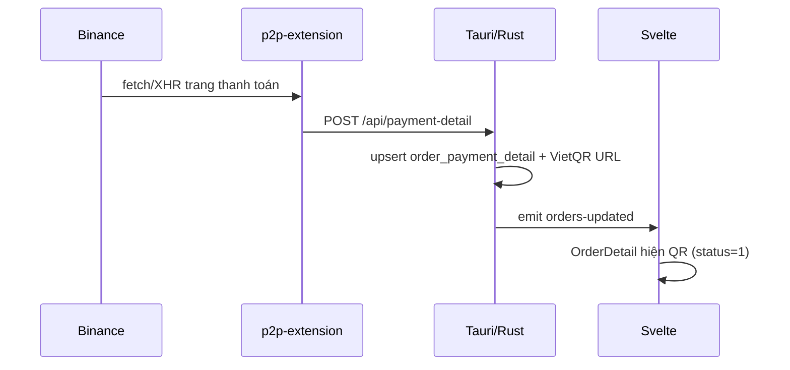
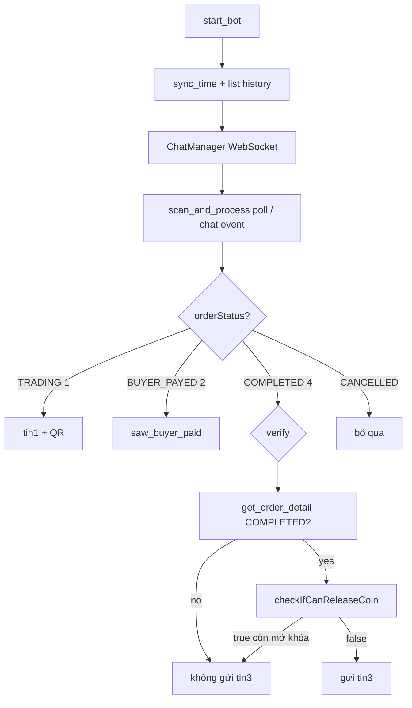

# Flow code — luồng hoạt động & code liên quan

Tài liệu này mô tả luồng runtime của app và chỉ tới file/hàm chính. Tổng quan sản phẩm: [README.md](./README.md) · kiến trúc: [ARCHITECTURE.md](./ARCHITECTURE.md).

---

## 1. Khởi động app



| Bước | Code |
|------|------|
| Entry | `src-tauri/src/main.rs` |
| Bridge health / payment | `src-tauri/src/bridge/` (Axum), `POST /api/payment-detail` |
| Sync lệnh | `src-tauri/src/api/sync_engine.rs`, `orders/repo.rs` |
| Credentials | `src-tauri/src/api/credentials.rs` (Windows keyring) |
| UI shell | `fe/src/routes/+page.svelte` |
| Panel bot | `fe/src/lib/BotPanel.svelte` |

---

## 2. Luồng BUY (mua) — extension + VietQR



| Bước | Code |
|------|------|
| Hook network | `p2p-extension/injected.js` |
| Queue + POST | `p2p-extension/background.js`, `content.js` |
| Nhận payment | `main.rs` → `orders/payment_repo.rs` |
| Sinh URL QR | `src-tauri/src/vietqr.rs` |
| Hiện/ẩn QR | `fe/src/lib/OrderDetail.svelte` (`showPayment`, status 1) |
| Map status | `src-tauri/src/orders/repo.rs` (`status_from_value`) |

**Quy tắc CK BUY:** chuỗi config nguyên văn → `addInfo`; trống → không gắn `addInfo`.

---

## 3. Luồng BOT SELL — tin nhắn tự động + QR chat

Chỉ xử lý lệnh **BÁN** (`tradeType=SELL`). State: `%LOCALAPPDATA%\BinanceP2PManager\bot_state.json`.



### 3.1 Start / stop

| Việc | Code |
|------|------|
| Commands UI | `src-tauri/src/bot/mod.rs` — `start_bot`, `stop_bot`, `get_bot_config`, `save_bot_config` |
| Config | `src-tauri/src/bot/config.rs` → `bot_config.json` |
| Session | `src-tauri/src/bot/session.rs` — `run_session`, `Bot::run` |
| Log UI | `src-tauri/src/bot/app_log.rs` → event `bot-log` |

### 3.2 Quét lệnh

| Việc | Code |
|------|------|
| History SELL | `BotBinanceClient::list_recent_sell_orders` — `binance.rs` |
| Vòng quét | `Bot::scan_and_process` — `session.rs` |
| Trigger sớm | `chat.rs` `handle_incoming` → `event_notify` |

### 3.3 Tin 1 + ảnh QR (khi `TRADING`)

| Việc | Code |
|------|------|
| Gate + retry | `try_send_welcome` |
| Chi tiết / STK | `get_order_detail` + `extract_payment_info` |
| Tên buyer QR | `normalize_person_name` (`Ð/Đ` → `D`) |
| Placeholder | `{ma_lenh}`, `{so_tien}`, `{ten_nguoi_mua}` trong `qr_transfer_content` |
| VietQR URL | `vietqr::image_url_with_account_name` |
| PNG→JPEG, presign, upload, CDN | `prepare_chat_qr_image` + `binance.rs` |
| Gửi WS | `ChatManager::send_text` / `send_image` — `chat.rs` |
| Xác nhận ảnh trong chat | `list_chat_messages` + `chat_has_self_image` |
| Bổ sung QR nếu thiếu | `try_resend_missing_qr` / `send_qr_only` |

### 3.4 Tin 3 (chỉ khi hoàn tất thật)

| Điều kiện | Ý nghĩa |
|-----------|---------|
| `welcome_sent` | Đã gửi tin1 (không spam lệnh cũ) |
| History `COMPLETED` | Ứng viên |
| Detail `COMPLETED` | Xác nhận lại |
| `checkIfCanReleaseCoin == false` | Không còn nút mở khóa |
| `instruction_message` không rỗng | Có nội dung để gửi |

| Việc | Code |
|------|------|
| Gate | `try_send_complete` — `session.rs` |
| Release check | `BotBinanceClient::can_release_coin` — `binance.rs` |
| Gửi text | `send_complete` → `ChatManager::send_text` |

**Không gửi tin 3** khi chỉ `BUYER_PAYED` / UI còn “Mở khóa nhanh”, kể cả khi history báo `COMPLETED` sớm.

### 3.5 Chat WebSocket

| Việc | Code |
|------|------|
| Credential | `retrieve_chat_credential` |
| Loop + reconnect | `chat.rs` `run_loop` |
| Frame text/image | `send_text`, `send_image` (`imageType: IMAGE`) |

---

## 4. Status Binance → code

| String | Code | Bot |
|--------|------|-----|
| `TRADING` / `PENDING` | 1 | Tin 1 + QR |
| `BUYER_PAYED` / `PAID` | 2 | Đánh dấu paid; **không** tin 3 |
| `DISTRIBUTING` / `VERIFYING` | 3 | Đánh dấu paid; **không** tin 3 |
| `COMPLETED` | 4 | Ứng viên tin 3 (sau verify) |
| `CANCELLED`… | 6/7 | Bỏ qua |

Map: `session.rs` `order_status_code` · UI/sync: `orders/repo.rs`.

---

## 5. Dữ liệu local

| Path | Nội dung |
|------|----------|
| `%LOCALAPPDATA%\BinanceP2PManager\` | SQLite, sync state |
| `bot_config.json` | Tin chào, tin 3, CK QR, poll, TK dự phòng |
| `bot_state.json` | `welcome_sent` / `complete_sent` / attempts theo `orderNumber` |
| Windows Credential Manager | API key/secret |

---

## 6. UI tabs liên quan

| Tab | File | Việc |
|-----|------|------|
| Dashboard / lệnh | `+page.svelte`, list components | Sync, xem lệnh |
| Chi tiết + QR BUY | `OrderDetail.svelte` | Hiện QR status 1 |
| **Bot** | `BotPanel.svelte` | Config + start/stop + log |
| Cài đặt | settings trong `+page.svelte` | API, CK BUY, sync |

---

## 7. Build / release

```powershell
npm.cmd run tauri:build
```

Output NSIS: `src-tauri/target/release/bundle/nsis/`. Chi tiết: [USER_GUIDE.md](./USER_GUIDE.md) mục 7, [WORKFLOW.md](./WORKFLOW.md).
